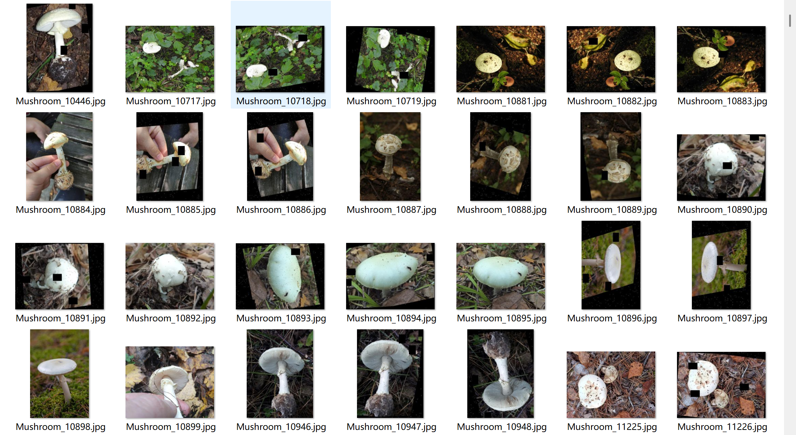
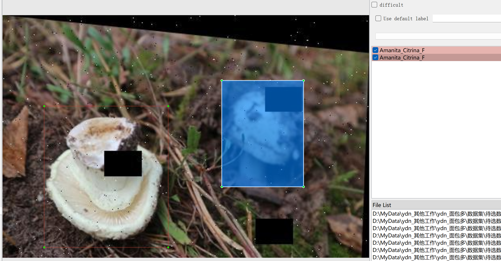
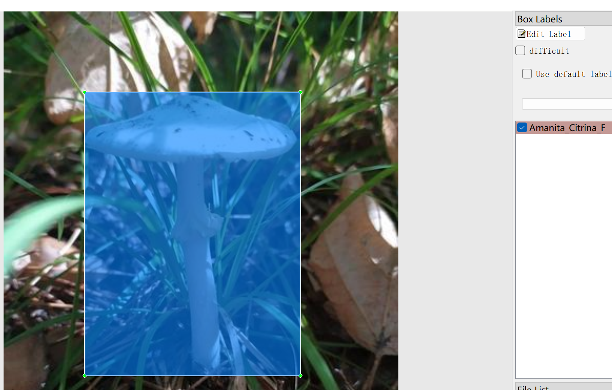

# Mushroom Varieties and Edible Identification - Target Detection Dataset

Dataset Information: The dataset consists of 5386 images, each accompanied by a corresponding annotation file. The annotation files are provided in two formats: VOC formatted as XML files and YOLO formatted as txt files.

The objects to be identified include the following eleven species:
- Agaricus Biporus T
- Agrocybe Aegerita T
- Amanita Citrina F
- Amanita Hemibapha F
- Amanita Javanica F
- Amanita Pantherina F
- Boletus T
- Cantharellus Cibarius T
- Dictyophora Indusiate T
- Lentinus Edodes T
- Russula Emetica F

The number of images and the number of bounding box per image are as follows: (Annotations are typically labeled in English, but the Chinese names for the objects are provided in parentheses for reference)
Note: An image may contain multiple objects, so the total number of bounding boxes might exceed the number of images.
A complete dataset is available in three folders along with a txt file:
- all_txt folder and classes.txt: Stores the YOLO formatted txt annotations, in the same quantity as the images, with each annotation file corresponding to one image.
- classes.txt:
- all_xml file: VOC formatted XML annotation file.
- The numbers and images are the same, each annotation file corresponds to one image.
For a detailed understanding of the VOC format standard files, please refer to your own search on Baidu.
Both the two formats are usable, choose one of them according to your preference.
Annotation Screenshot:

## Images

Here is a pay link on Stripe ( https://buy.stripe.com/3cs8yP7sY87d0vu9AB ). Please contact me lonlonago@foxmail.com after funding $89, and I will send you a complete data files , thank you!

